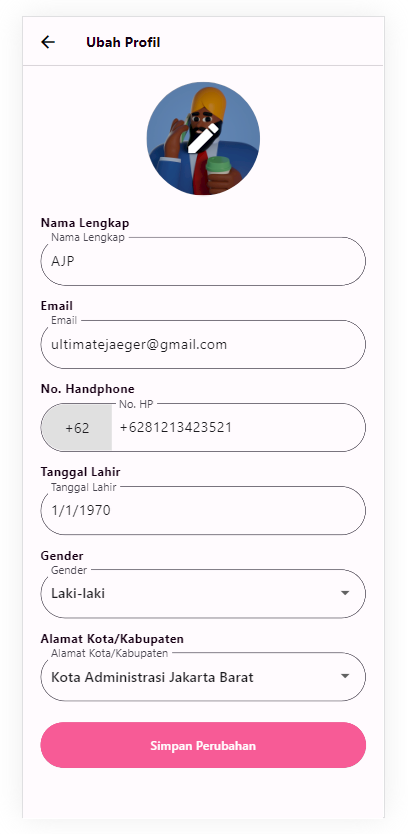
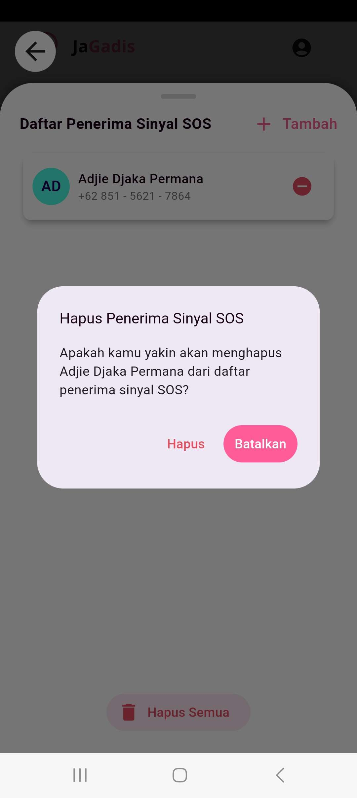

# JaGadis - Presented by Kyrios Team

## Members:

1. Adjie Djaka Permana (**Hacker**)
2. Dimas Herjunodarpito N (**Hacker**)
3. Nur Fajar Sayyidul Ayyam (**Hipster**)
4. Syifa Nurul Awaliah (**Hustler**)

## Description:

JaGadis, an anti-harassment platform that makes it easy for users to report incidents related to harassment they experience. Users can enter contacts they trust so that whenever users feel they are in a dangerous situation, they can report it very quickly. Users can also hire personal bodyguards from trusted partners or users can also consult with experienced therapists.

This platform is developed using the following tech stack below:

1. **Implemented**

- Flutter, used to develop mobile UI for the platform
- Go, used to develop the API for the platform
- Google Maps API, used to show the source of the SOS signal
- Redis, used as the rate limiter for the incoming requests

2. **Soon to be Implemented**

- Websocket, will be used to make the source of the SOS signal updated in real-time
- Firebase, will be used to send a push notification of SOS signal to the trusted contacts
- Google auth, will be used as an alternative ways to login to the app

This platform can be used after the user logs into their registered account. To be able to send an SOS signal, users must first enter contacts that they trust. These contacts must be contacts from other JaGadis users. Users can turn on the standby mode which makes JaGadis run as a _background service_ that will be ready to respond to actions from the user if the user feels in danger. The user can turn off the standby mode or press the power button on their device three times simultaneously to send a notification to the registered contact. The contact who gets the notification can track the user who sent the SOS signal.

## Screenshots:

1. **Splash Screen**
     

2. **Login Screen**

   

3. **Register Screen**

   

4. **Profile Screen**

   

5. **Edit Profile Screen**

   

6. **Home Screen**

   

7. **Contact Registration Dialogue**

   

8. **Contact Sheet Expanded**

   

9. **Delete Contact Dialogue**

   

10. **Delete All Contact Dialogue**

   

11. **Home Screen (Standby Mode Activated)**

12. **Tracking Screen (Empty)**

13. **Tracking Screen**

14. **Location Screen**

